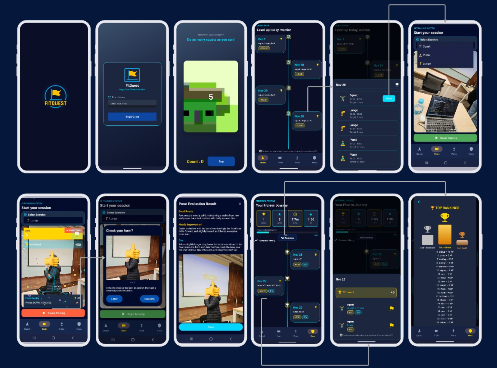

# FitQuest

An AI-powered virtual sports personal trainer (PT) application.  
Sportify leverages smartphone cameras and AI models to provide real-time posture correction, personalized training plans, smart equipment recommendations, and a social sports-mate matching feature.  

### Screen video for iteration is provided in this link [video](./docs/video/Screen_Recording_20251127_151316_FitQuest.mp4)

## Features

- **AI Posture Correction**  
  Real-time feedback using camera input and pose-estimation models.  
  (Starting with Squat, and more exercises will be supported later.)

- **Training Plan & Scheduling**  
  AI generates structured lesson plans and syncs them with the user’s calendar.

- **Skill Level Tracking**  
  Records progress, provides gamified achievements, and adapts training difficulty.

- **Sports Mate Finder** *(Additional Feature)*  
  Match users with similar skill levels and goals.

## Target Customers

- Amateur athletes and sports enthusiasts who want structured training without hiring an expensive coach.  
- Beginners who want to learn sports safely with proper posture guidance.  
- Individuals seeking motivation and personalized support to sustain consistent exercise habits.  

## Motivation

- **Problem**: In most sports, unlike gyms with personal trainers, there is no one-on-one guidance for beginners. This creates high entry barriers—proper form requires professional coaching, and choosing beginner-friendly equipment is often confusing, leading to loss of motivation.  
- **New Feature in Market**: Our system provides AI-based posture correction, personalized training plans, and smart equipment recommendations—capabilities missing in traditional sports apps.  
- **Why Important & Exciting**: Sportify lowers the barrier to sports participation, prevents “three-day resolutions” by offering structured guidance, and makes training more engaging through gamification and sports-mate matching, promoting both personal health and social connection.  

## Devices Needed

- Samsung Galaxy Note 20 (Already provided)  
- Galaxy Watch (Optional)  

## Test & Demo

- Create a new user account and set up a personal sports profile.  
- Demonstrate real-time AI posture correction feedback using the smartphone camera.  
- Show how the system generates a personalized training plan
- Showcase the Sports Mate feature by matching the user with another account of similar skill level.  

## Getting Started

### Prerequisites

- Android Studio 4.2.1 or higher  
- Minimum Android SDK Version 21  

### Installation

[Installation link here](./docs/installation.md)
